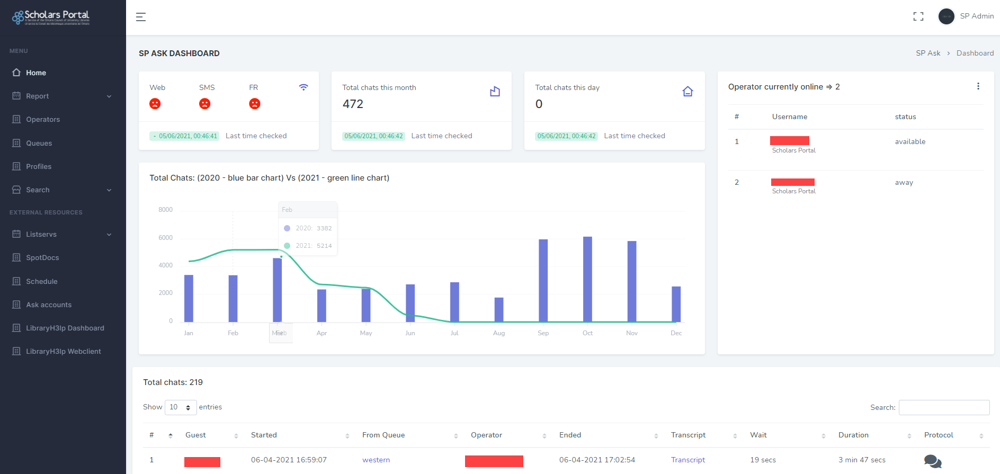

Sp Ask DashBoard
======================================================

  - Yet another LibraryH3lp admin Dashboard
  - This is not intended to replace the LH3 Dashboard but to add other features.

## Screenshots

#### Table of contents
- [Install with Docker](#install-with-docker)
- [Install with python or poetry](#install-with-python-or-poetry)
- [Install with poetry](#install-with-poetry)
- [Install with Ansible](#install-with-ansible)

## Install with Docker

        git clone https://github.com/scholarsportal/sp_ask_admin_dashboard.git

In the current directory, rename **secrets-exemple** to **.secrets** (there is a dot before the filename). 

        mv secrets-example .secrets

Add your LibraryH3lp **username** and **password** - without quotes

        salt=asjdflkajs
        scheme=https
        server=ca.libraryh3lp.com
        timezone=America/Montreal
        version=v2
        username=
        password=

Run Docker to access the web application

	docker-compose up --build --force-recreate -d

open your browser on http://127.0.0.1/ or the ip address of your server IP address 000.000.000.000

## Install with Python or Poetry

        git clone https://github.com/scholarsportal/sp_ask_admin_dashboard.git

In the current directory, rename **secrets-exemple** to **.secrets** (there is a dot before the filename). 

        mv secrets-example .secrets

Add your LibraryH3lp **username** and **password** - without quotes

        salt=asjdflkajs
        scheme=https
        server=ca.libraryh3lp.com
        timezone=America/Montreal
        version=v2
        username=
        password=

replace lh3_service_* with your main **queues** or leave empty after the equal sign. Then, you could verify the configuration by typing on your terminal:
        
        pip install -r requirements.txt
        python manage.py check
        #or with poetry
        poetry run python manage.py check

Run the Python application 

	python manage.py runserver
        #or
        poetry run python manage.py runserver

        
open your browser on http://127.0.0.1:8000/

## Install with Ansible

        #TODO

## Credit
[LibraryH3lp API](https://gitlab.com/libraryh3lp/libraryh3lp-sdk-python/) -MIT

## Contributors
 - Amy (LibraryH3lp)
 - Dan S (Laurentian U)
 - Aleksandra (Carleton)
 - Erik R (Western)
 - Bart K (Scholars-Portal)
 - Sabina P (Scholars-Portal)
